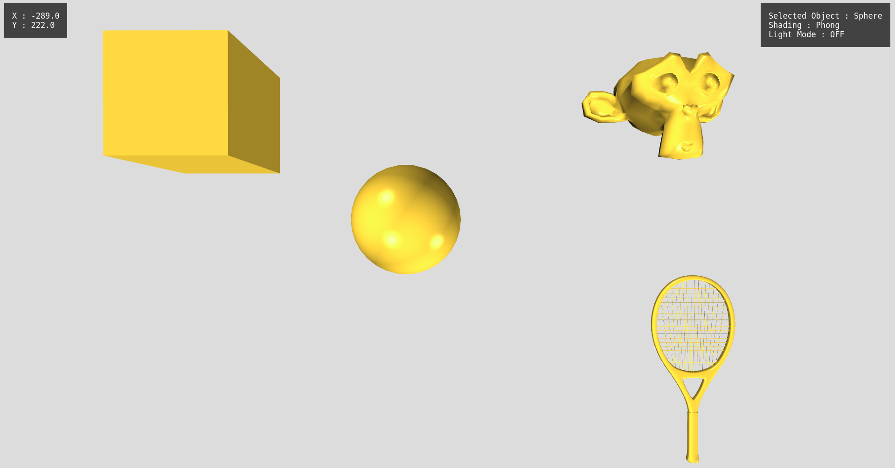
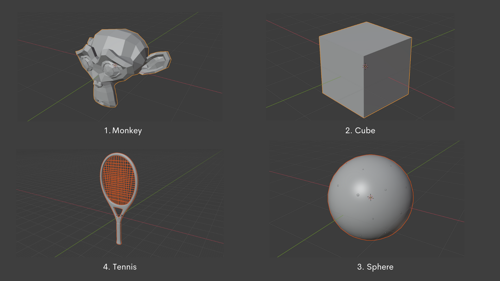

# Assignment 3

## Overview
This program is an introduction to lighting in 3D in WebGL and builds upon [this](https://github.com/agam-kashyap/Computer-Graphics-Vanilla3d) codebase. The program consists of four 3D objects upon which we perform various actions such as translations, rotation(using quaternions), scaling along with manipulating the shading methods and lightings. 

*Shows the four different models used in the program*

## Instructions and Key Bindings

Use the Number keys to select or deselect an Object
- 3 -> To select Monkey
- 4 -> To select Cube
- 5 -> To select Sphere
- 6 -> To select Tennis Racket
- 2, 7, 8, 9 -> To deselect any Selected Object

Once an Object has been selected the following actions can be performed.
- Use the arrow Keys to translate
- Drag the mouse around to rotate the objects
- Press "s" to change the shading mode between Phong and Gourad
- Press "i" to turn on illumination mode
  - Use 1/0 to turn on/off the lights
  - Use "h" "l" to translate along the X axis
  - Use "j" "k" to translate along the Y axis
  - Use "a" "d" to translate along the Z axis

## File Structure

- VideoReport.mp4
- Images
  - Mesh.png
  - MultiLight(1 source).png -> Contains all light turned off except that of sphere effect
  - MultiLight(3 sources).png -> Contains all lights on except sphere's effect
  - OffLight.png -> All lights off
- Report.pdf
- Source
  - 3DMesh.js
  - globalStyle.css
  - index.html
  - index.js
  - Light.js
  - models
    - Cube
      - cube.obj
    - monkey.obj
    - Sphere
      - sphere.obj
    - Tennis
      - tennis.obj
  - renderer.js
  - shader.js
  - Shaders
    - Gourad
      - fragment.js
      - vertex.js
    - Phong
      - fragment.js
      - vertex.js
  - transform.js
